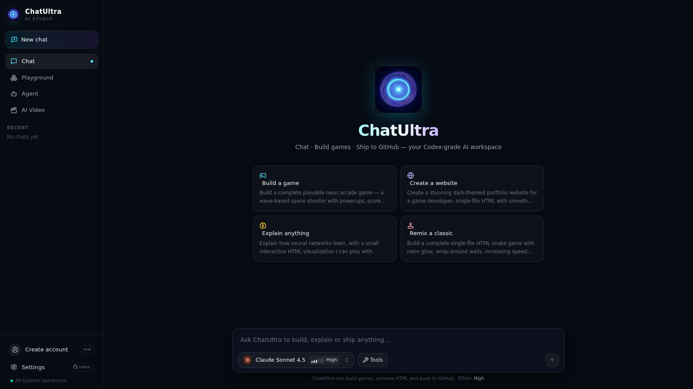
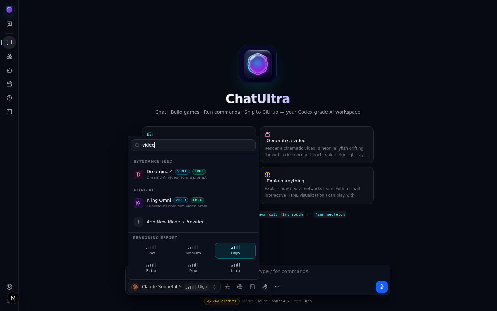
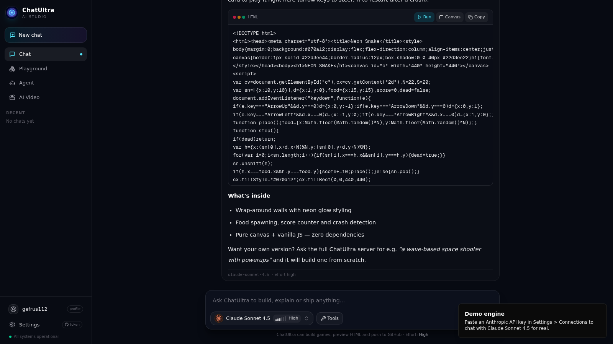
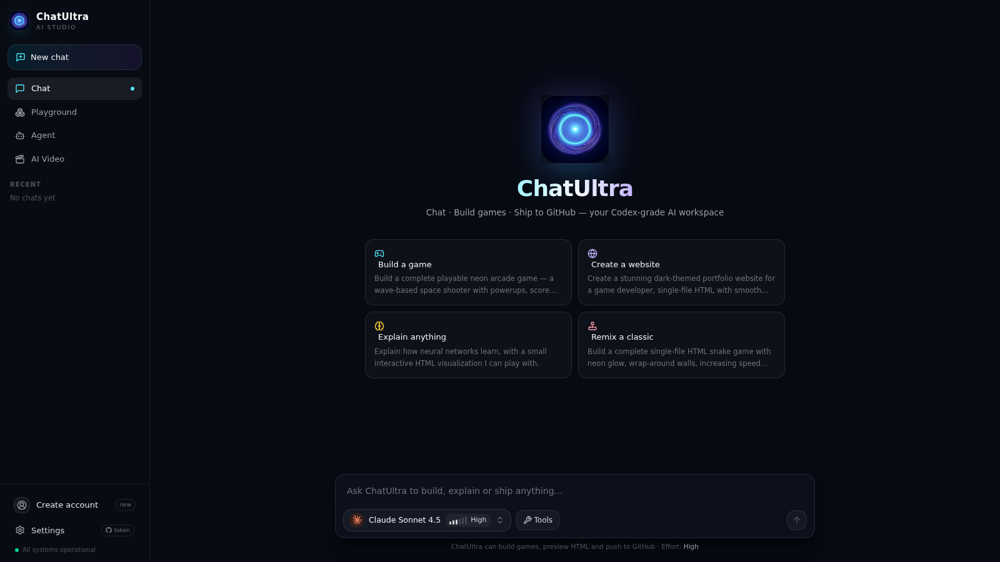
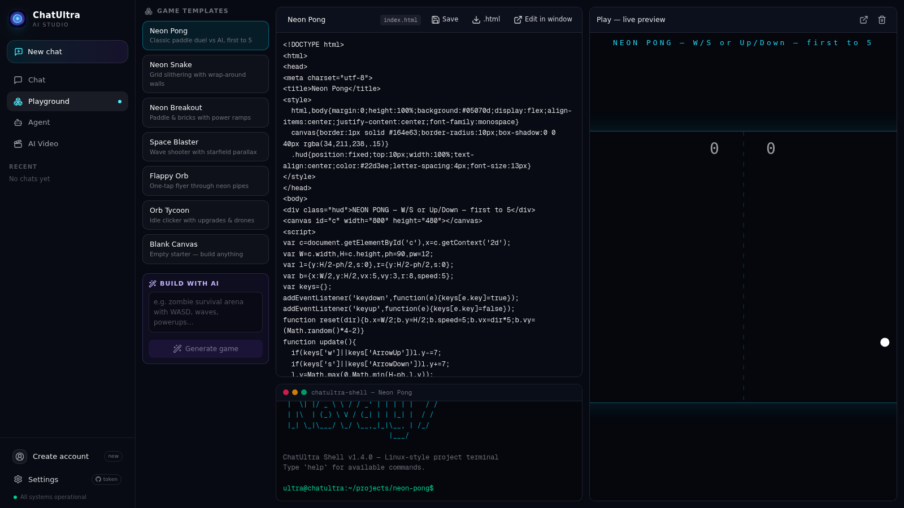
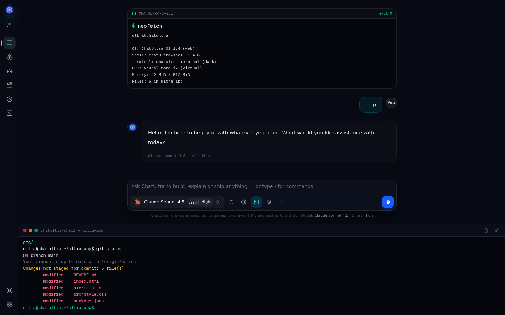
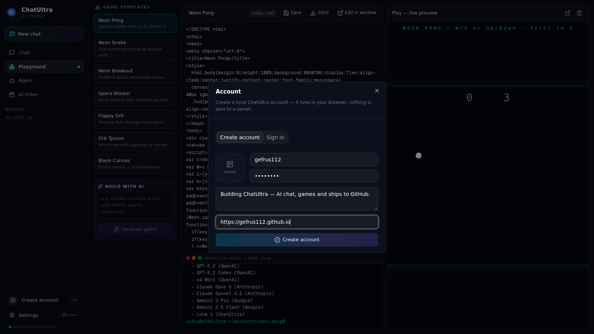
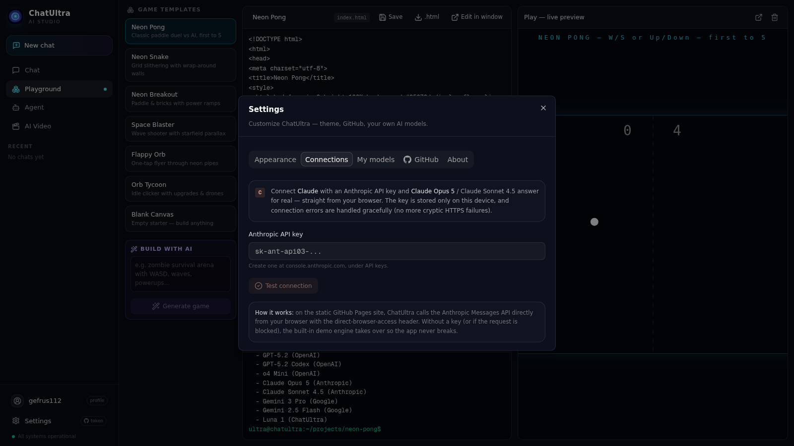

# ChatUltra

<p align="center"></p>

**ChatUltra** is a dark, Codex-style AI studio that runs anywhere — chat with GPT-5.2, **Claude Opus 5**, Claude Sonnet 4.5, Gemini 3 Pro & Luna, dial reasoning effort from **Low to Ultra**, preview HTML live, build games in the Playground, drive a Linux-style terminal, create a profile, and push projects straight to GitHub.

Live site: **https://gefrus112.github.io/chat-gpt/** &middot; Repo: `gefrus112/chat-gpt`



---

## How it looks

### Codex-style model picker — Claude Opus 5 included

Real brand icons for every model, plus the six-step reasoning effort dial (Low / Medium / High / Extra / Max / Ultra).



### Chat that builds playable things

Ask for a game and ChatUltra streams back a complete single-file HTML build with **Run**, **Canvas** and **Copy** actions — press Run to play it instantly.



### Welcome screen



### Game Playground

Seven ready-made templates (Neon Pong, Neon Snake, Breakout, Space Blaster, Flappy Orb, Orb Tycoon, Blank) — run them live, edit the code, pop the editor out into a **separate window**, push the project to GitHub.



### Built-in Linux-style terminal

`chatultra-shell` ships with `help`, `ls`, `cat`, `run`, `build`, `git status`, `git push`, `models`, `neofetch` and more.



### Accounts & profiles

Create a local account, upload a profile picture, edit your bio and website link — stored in your browser, nothing sent to a server.



### Connect real Claude (Opus 5)

Paste an Anthropic API key under **Settings > Connections** and Claude Opus 5 / Sonnet 4.5 answer for real, straight from the browser. Connection failures are handled gracefully — no cryptic HTTPS errors, the app always falls back to the built-in demo engine.



---

## Features

- **9 built-in models** — GPT-5.2, GPT-5.2 Codex, o4 Mini, Claude Opus 5, Claude Sonnet 4.5, Gemini 3 Pro, Gemini 2.5 Flash, Luna 1 — each with its real brand icon
- **Reasoning effort dial** — Low, Medium, High, Extra, Max, Ultra with signal-bar indicator
- **Custom AI models** — create your own agents with a picture avatar, system prompt and accent color; they appear in the picker
- **Real Claude** — add an Anthropic key in Settings > Connections; ChatUltra calls the Messages API directly from the browser (with the direct-browser-access header) and maps every failure to a friendly message
- **HTML live preview** — every code card has Run / Canvas actions with a sandboxed live preview you can edit
- **Game Playground** — 7 game templates, AI game builder, external editor window (popout syncs back), one-click **Push to GitHub** via your access token
- **chatultra-shell terminal** — Linux-style project terminal with build logs, git push and neofetch
- **Agent & AI Video studios** — multi-step agent plans and multi-frame AI video renders
- **Local accounts** — sign up, upload a profile picture, edit bio and website link
- **GitHub integration** — paste a personal access token, test the connection, push Playground projects to `gefrus112/chat-gpt`
- **Dark by design** — Codex-grade dark UI, six accent colors, glow effects, monospace mode, compact sidebar

## Run locally

```bash
bun install            # or npm install
bun run dev            # http://localhost:3000
```

Full server mode uses the bundled AI backend and SQLite (Prisma). Without a backend (static hosting) ChatUltra automatically switches to its demo brain, localStorage persistence and browser-side GitHub push.

## Static export for GitHub Pages

```bash
bash scripts/static-export.sh   # builds the site into ./out
```

Deployed from the `gh-pages` branch to: https://gefrus112.github.io/chat-gpt/

## GitHub integration

1. Create a personal access token at [github.com/settings/tokens](https://github.com/settings/tokens) (fine-grained, with **Contents: Read & write** on your target repo)
2. Open **Settings > GitHub**, paste the token, confirm the repo (`gefrus112/chat-gpt`) and press **Test connection**
3. In the Playground, press **Push to GitHub** — your project lands in the repo; the terminal's `git push` does the same

The token is stored only in your browser's localStorage and is never sent anywhere except `api.github.com`.

## License

MIT
