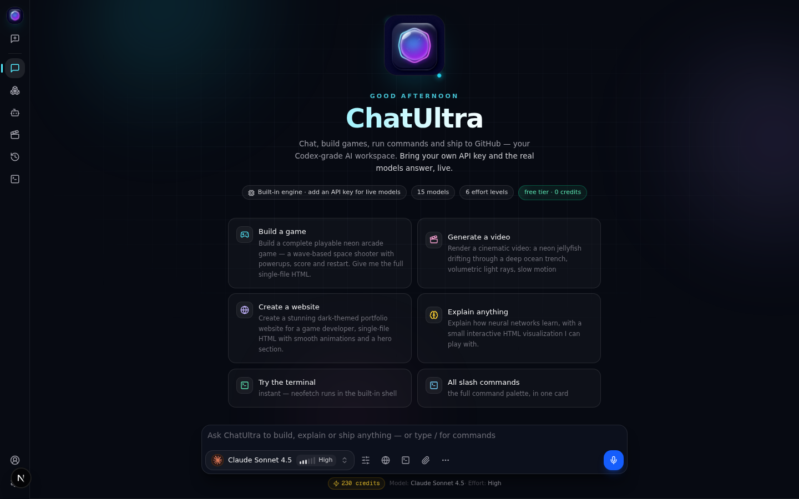
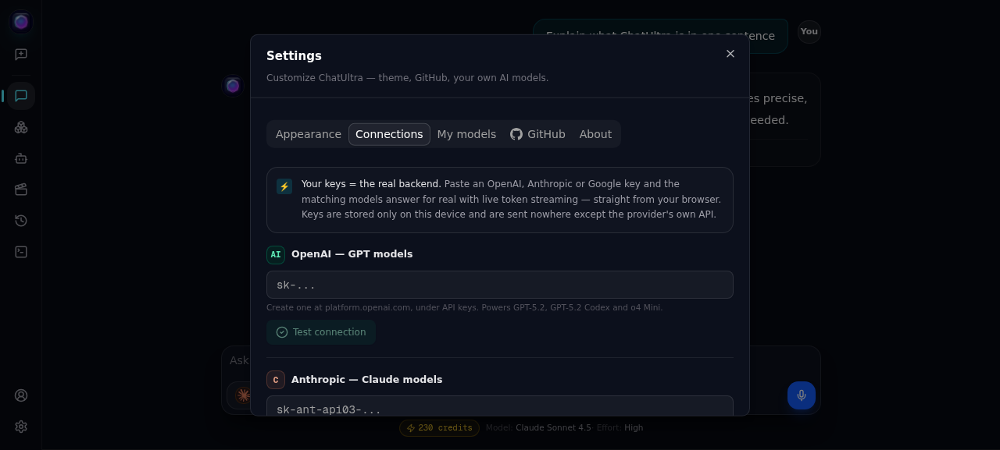
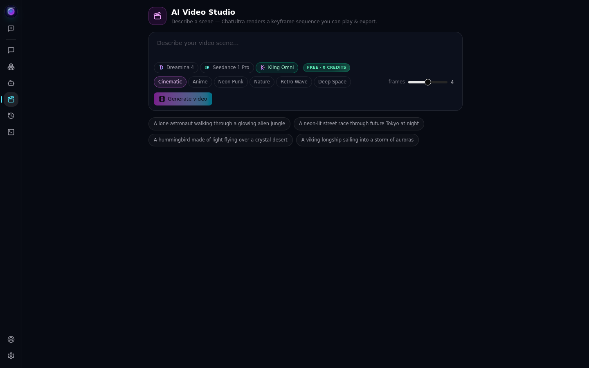
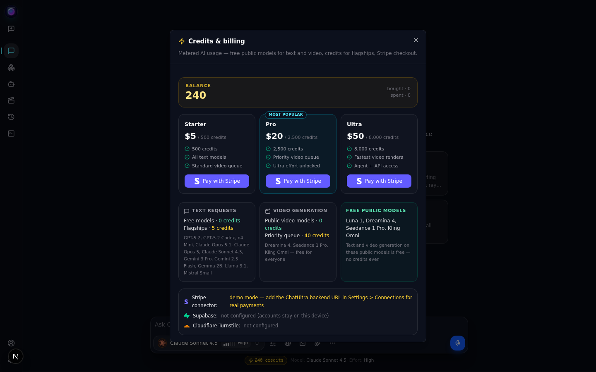

# ChatUltra

<p align="center"></p>

**ChatUltra v3** is a dark, Codex-style AI studio that runs anywhere — **bring your own API keys (OpenAI, Anthropic, Google) and the real models answer live with token streaming**, chat with GPT-5.2, **Claude Opus 5.1**, Claude Opus 5, Claude Sonnet 4.5, Gemini 3 Pro, Luna and local models, **generate AI videos with Dreamina 4, Seedance 1 Pro and Kling Omni (free)**, top up **credits with Stripe**, sync accounts to **Supabase** (with **Cloudflare Turnstile** protection), run a **real backend from a folder with your own API keys**, run shell commands right in the chat, preview HTML live, build games in the Playground, and push projects straight to GitHub — all wrapped in a new **aurora hero home page** with animated orbs, orbiting logo sparks, a time-based greeting and a live provider marquee.

Live site: **https://gefrus112.github.io/chat-gpt/** &middot; Repo: `gefrus112/chat-gpt`


---

## How it looks

### Codex-style interface

Slim icon rail on the left, model chip + effort dial + toolbar (effort, web access, terminal, attach, more), a credits chip and a voice-input mic in the composer — the full Codex/Jan-style layout in dark mode, with smooth motion everywhere: message entrances, floating hero, shimmering FREE badges, typing dots and a streaming caret.


### New aurora hero home page (v3)

Animated aurora orbs, an engineering grid, orbiting spark dots around the logo, a time-based greeting ("Good evening"), live brain-status chips ("Live · your OpenAI key" / "Built-in engine"), six one-click starter cards and a scrolling provider marquee — every element rises in with staggered motion.



### Your API keys = the real backend (v3)

Paste an **OpenAI**, **Anthropic** or **Google** key in Settings > Connections, press **Test connection**, and the matching models answer for real — streamed token-by-token straight from your browser. Keys are stored only on this device and sent nowhere except the provider's own API. Model fallback chains (e.g. GPT-5.2 → GPT-5 → GPT-4.1) keep older keys working, and friendly errors replace cryptic HTTPS failures.



### Message actions (v3)

Every answer gets a **Copy** button (with "Copied" feedback) and the newest answer gets **Regenerate** — one click re-runs your last prompt with the picked model and effort.

### Searchable model picker — video models included

Type-to-search across grouped providers (OpenAI, Anthropic, Google, ChatUltra, **ByteDance Seed**, **Kling AI**, Local AI). Video models carry **VIDEO + FREE** badges — Dreamina 4, Seedance 1 Pro and Kling Omni are free public models for everyone.


### AI Video Studio — Dreamina · Seedance · Kling Omni

Pick a video model, describe a scene, hit Generate. In the browser the keyframe pipeline renders a playable, exportable sequence; with the backend connected the same flow renders real video through fal.ai / Kling AI APIs. Video generation on public models is **free — 0 credits**.



### Run commands from the chat

Type `/` for slash commands (`/run`, `/models`, `/effort`, `/video`, `/credits`, `/terminal`, `/git push`...), press **Run** on any bash code card, or open the built-in terminal drawer (Ctrl + `). Commands execute in the sandboxed `chatultra-shell` with real exit codes — here the `credits` command:


### Credits & billing with the Stripe connector

A real credit balance, three top-up plans paid through **Stripe Checkout** (real Stripe connector via the backend, demo mode without it), per-model pricing and a permanent free tier: public models cost nothing for both text and video.



### Connections — Claude, ChatUltra Backend, Supabase, Cloudflare

Settings > Connections brings everything together: real Claude (Opus 5.1 / Opus 5 / Sonnet 4.5) via an Anthropic key, the **ChatUltra Backend** (URL + key with health check), **Supabase** account cloud sync, and **Cloudflare Turnstile** signup protection.


### Chat that builds playable things

Ask for a game and ChatUltra streams back a complete single-file HTML build with **Run**, **Canvas** and **Copy** actions — press Run to play it instantly.


### Game Playground

Seven ready-made templates (Neon Pong, Neon Snake, Breakout, Space Blaster, Flappy Orb, Orb Tycoon, Blank) — run them live, edit the code, pop the editor out into a **separate window**, push the project to GitHub.


### Accounts & profiles

Create an account, upload a profile picture, edit your bio and website link — stored in your browser, and synced to your own Supabase project when configured (Turnstile-ready).


---

## Features

- **14 built-in models** — GPT-5.2, GPT-5.2 Codex, o4 Mini, **Claude Opus 5.1**, Claude Opus 5, Claude Sonnet 4.5, Gemini 3 Pro, Gemini 2.5 Flash, Luna 1, Local AI (Gemma 2B, Llama 3.1, Mistral Small) + **video models: Dreamina 4, Seedance 1 Pro, Kling Omni** — each with its own (brand-accurate or hand-crafted) icon
- **Your API keys = the real backend (BYOK)** — paste an OpenAI / Anthropic / Google key in Settings > Connections and those models stream live token-by-token from the browser; keys stay on-device; friendly validation with **Test connection** buttons
- **Aurora hero home page** — animated orbs + grid, orbiting logo sparks, time-based greeting, brain-status chip, 6 starter cards, provider marquee, staggered entrances
- **Message actions** — Copy (with feedback) on every answer, Regenerate on the latest, stop-generation anytime
- **Free public models** — video generation and text on Dreamina 4, Seedance 1 Pro, Kling Omni and Luna 1 never cost credits
- **Credits & Stripe** — balance chip in the composer, `/credits` command, three plans, Stripe Checkout through the backend connector
- **Accounts** — local signup with hashed passwords, avatar upload, bio, website link; one-click **Sync to Supabase**; Cloudflare Turnstile widget support
- **Real backend folder** — `backend/` ships a complete Express server: text generation (OpenAI / Anthropic / Google), video generation (fal.ai for ByteDance models, Kling AI API), Stripe checkout, Supabase sync and Turnstile verification — every key optional, free models always work
- **Run commands** — slash commands (`/run`, `/models`, `/effort ultra`, `/video`, `/credits`, `/git push`, `/export`...), **Run** buttons on every bash code card, and a dockable terminal drawer (Ctrl + `)
- **Reasoning effort dial** — Low, Medium, High, Extra, Max, Ultra with signal-bar indicator
- **Motion design** — message entrances, dropdown pops, floating hero, shimmer FREE pills, typing dots, streaming caret, render sweep on video cards (all `prefers-reduced-motion` safe)
- **Voice input + file attachments**
- **Custom AI models** — create your own agents with a picture avatar, system prompt and accent color
- **HTML live preview** — every code card has Run / Canvas actions with a sandboxed live preview you can edit
- **Game Playground** — 7 game templates, AI game builder, external editor window (popout syncs back), one-click **Push to GitHub**
- **chatultra-shell terminal** — Linux-style shell with build logs, git push, `credits`, `models` and neofetch
- **GitHub integration** — paste a personal access token, test the connection, push Playground projects to `gefrus112/chat-gpt`
- **Dark by design** — Codex-grade dark UI, six accent colors, glow effects, monospace mode, new crisp vector favicon + regenerated app icon

## Run locally

```bash
bun install            # or npm install
bun run dev            # http://localhost:3000
```

Full server mode uses the bundled AI backend and SQLite (Prisma). Without a backend (static hosting) ChatUltra automatically switches to its demo brain, localStorage persistence and browser-side GitHub push.

## Real backend (API keys, Stripe, Supabase)

There are two ways to go live:

**1. BYOK — fastest, zero setup (v3).** Settings > Connections > paste your OpenAI / Anthropic / Google key > Test connection. Done — GPT, Claude and Gemini models answer for real with live streaming, straight from the browser. Works on the static GitHub Pages site too.

**2. The `backend/` folder — full server.** Real text + video generation, Stripe credits, Supabase accounts:

```bash
cd backend
cp .env.example .env   # fill in the keys you have — all optional
npm install && npm start
```

| Key | Powers |
| --- | --- |
| `OPENAI_API_KEY` | GPT-5.2 flagships |
| `ANTHROPIC_API_KEY` | Claude Opus 5.1 / Opus 5 / Sonnet 4.5 |
| `GOOGLE_API_KEY` | Gemini 3 Pro |
| `FAL_KEY` | Dreamina 4 + Seedance 1 Pro video |
| `KLING_API_ID` + `KLING_API_KEY` | Kling Omni video |
| `STRIPE_SECRET_KEY` | Real Stripe Checkout for credits |
| `SUPABASE_URL` + `SUPABASE_SERVICE_KEY` | Account cloud sync |
| `CLOUDFLARE_TURNSTILE_SECRET` | Server-side signup verification |

Then point the web app at it: **Settings > Connections > ChatUltra Backend**. See [backend/README.md](backend/README.md) and [backend/supabase/schema.sql](backend/supabase/schema.sql).

## Static export for GitHub Pages

```bash
bash scripts/static-export.sh   # builds the site into ./out
```

Deployed from the `gh-pages` branch to: https://gefrus112.github.io/chat-gpt/

## GitHub integration

1. Create a personal access token at [github.com/settings/tokens](https://github.com/settings/tokens) (fine-grained, with **Contents: Read & write** on your target repo)
2. Open **Settings > GitHub**, paste the token, confirm the repo (`gefrus112/chat-gpt`) and press **Test connection**
3. In the Playground, press **Push to GitHub** — your project lands in the repo; the terminal's `git push` does the same

The token is stored only in your browser's localStorage and is never sent anywhere except `api.github.com`.

## License

MIT
